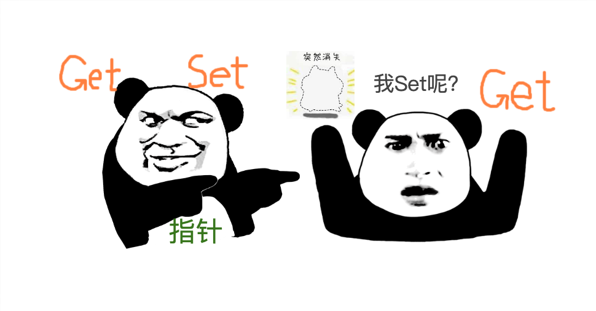

# 我的指针的方法，不是我的方法



## 问题

先出一道题给大家。下面的代码中，user是否实现了Namer接口？

```go
type Namer interface {
  GetName() string
  SetName(name string)
}

type User struct {
  Name string
  Age int
}

func (u User) GetName() string {  
  return u.Name
}

func (u *User) SetName(name string) {
  u.Name = name
}

var user User{} // user是否实现了Namer接口？
```

答案稍后揭晓。

## 方法与接收者

在Go语言中，每种命名类型都可以定义方法。方法比普通函数多一个特殊参数，叫做**接收者**。

接收者可以是指针类型，也可以是值类型，它们到底有什么区别？一开始学Go语言的时候，我也一头雾水。


指针类型的接收者之所以需要指针，就是因为它要**改变原对象的值**。在上面的例子中，调用user的SetName方法时，编译器会帮你把user的指针传递给SetName方法。

```go
func main() {
  user.SetName("Jack") // 编译器帮你把user的指针传给SetName方法，改变了user
  user.GetName() // Jack
  
  // 等价于下面两行：
  (*User).SetName(&user, "Jack")
  User.GetName(user)
}
```

但如果这样调用呢：

```go
func main() {
  User{}.SetName("Tom") // ERROR
}
```

由于User{}字面量并没有赋值给一个变量，所以没有指针，因此会报错。

## 函数的参数是值拷贝

现在，我们想定义一个函数，清除用户的姓名，你会怎么定义这个函数？

方案1:

```go
func clearUserName(u User) {
  u.SetName("")
}
```

方案2:

```go
func clearUserName(u *User) {
  u.SetName("")
}
```

想都不用想，当然选方案2了！为什么？因为go语言中，函数参数都是值拷贝，方案1传进来的是user的副本，根本没办法改变实参。


很好，下面我把清除函数的参数换成开头定义的Namer接口

```go
func clearNamerName(u Namer) {
  u.SetName("")
}
```

现在，我能否把user作为实参来调用clearName方法：

```go
var user User{} // 文章开头定义的user
func main() {
  clearNamerName(user) // 能否这样调用？
}
```


想一想，假如可以这样调用，那么clearNamerName方法能真的改变user的Name字段吗？

根本不可能，因为clearNamerName方法拿到的是user的副本，根本不可能改变原来的user对象。这违背了指针类型接收者的初衷：改变原对象。

## 方法集

如何能够在编译时就避免出现这样的问题？很简单，现在我规定，*User类型的方法包括SetName和GetName，而User类型的方法只有GetName（排除掉接收者为指针类型的SetName）。

在这个完美的规定下，判断user是否实现Namer接口时发现，user是User类型并没有SetName方法，因此user没有实现Namer接口，编译不通过！


当然了，这个完美的规定并不是我做的，这是**方法集**的概念。

> 对于类型T，
>
> 接收者为值类型的方法的集合为M
>
> 接收者为指针类型的方法的集合为\*M
>
> 那么：
>
> T类型的**方法集**为M
>
> \*T类型的**方法集**为M和\*M


## 组合类型的方法集

下面再来一个复杂的场景

```go
type Student struct {
  User
  Class string
}
```

Student中包含了User类型的匿名字段，这是Go语言里的组合。

猜一猜Student类型的方法集是什么？是否实现了Namer接口？


当Student类型作为函数参数传递时，会拷贝副本，其User字段也会进行拷贝，SetName就无法改变原对象的值，所以Student一定没有实现Namer接口。

当然了，\*Student类型在参数传递时只会拷贝指针，不会拷贝值，因此\*Student类型是实现了Namer接口的。

如何避免这个问题？聪明的你一定想到了。

```go
type Student struct {
  *User
  Class string
}
```

没错，只要内嵌字段改为指针类型即可。这样拷贝Student的时候，User字段只会拷贝指针，不会拷贝值。

对于组合结构，**方法集**这样定义

>若类型S包含匿名字段T，则S的方法集也包含T的方法集。
>
>若类型S包含匿名字段\*T，则S的方法集也包含T和\*T的方法集。
>
>无论类型S包含T还是\*T，\*S都包含T和\*T的方法集。

在判断一个类型是否实现一个接口时，编译器会严格按照接口集来校验。而对于一个该类型的实例，完全可以调用其指针的方法集，编译器会自动帮你转换。